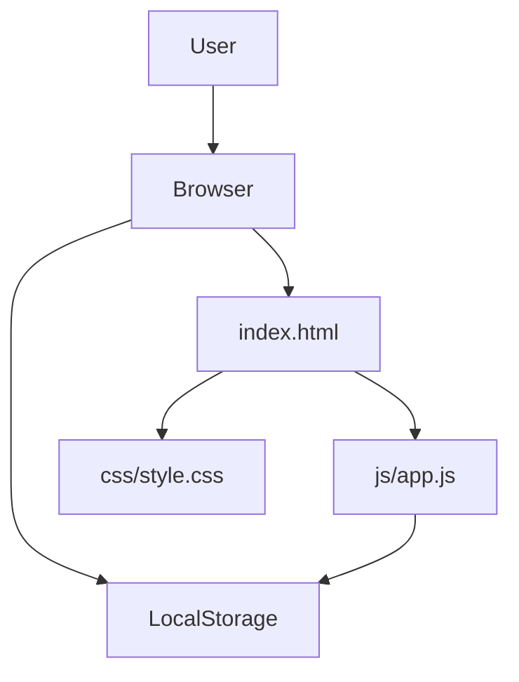

# Design Document — To-Do List Life Dashboard

## Document Information

- **Feature Name**: To-Do List Life Dashboard
- **Version**: 1.0
- **Date**: 2026-07-02
- **Author**: Mohammad El Qiliqsandy
- **Related Documents**:
  - Requirements: `requirements.md`

## Overview

The To-Do List Life Dashboard is a single-page web application built with vanilla HTML, CSS, and JavaScript. It provides a centralized dashboard with five integrated components — time display, greeting, focus timer, to-do list, and quick links — all running entirely client-side with data persisted through the browser's Local Storage API.

### Design Goals

- **Zero dependencies**: No external frameworks, libraries, or build tools — pure vanilla web stack
- **Client-side persistence**: All user data survives browser sessions via Local Storage
- **Responsive layout**: Usable at any screen size from mobile to desktop via CSS Grid
- **Minimal complexity**: Single file per technology (one HTML, one CSS, one JS) with no bundling step

### Key Design Decisions

- **CSS Grid over Flexbox** for the main layout because the card arrangement maps naturally to a 2-column grid template with named areas, making responsive reflow trivial
- **Module-level state variables** instead of a framework state manager because the complexity is low enough that raw arrays + render functions are easier to maintain than introducing any abstraction
- **`crypto.randomUUID()` for IDs** because it requires no library, no counter, and produces collision-resistant identifiers for both tasks and links
- **Inline editing for task/link edits** instead of modal dialogs to keep interactions fast and avoid additional overlay complexity

## Architecture

### System Context

The application runs entirely within the browser. There is no server, no API, and no external service dependency.



### Technology Stack

| Layer | Technology | Rationale |
|-------|------------|-----------|
| Markup | HTML5 | Universal browser support, semantic elements |
| Styling | CSS3 | CSS Grid, custom properties, media queries |
| Logic | JavaScript ES6+ | `crypto.randomUUID()`, `const`/`let`, arrow functions, template literals |
| Storage | Local Storage API | Persistent client-side key-value storage |
| Font stack | `-apple-system, BlinkMacSystemFont, "Segoe UI", Roboto, sans-serif` | Native OS fonts — zero network requests |

### File Responsibilities

| File | Responsibility |
|------|---------------|
| `index.html` | Declares semantic HTML containers for each component, loads CSS and JS |
| `css/style.css` | Card grid layout, component card styles, responsive breakpoints, typography, color scheme, interactive states |
| `js/app.js` | All component logic: state management, DOM manipulation, localStorage sync, timer intervals, event handling |

### Data Flow

1. **Page Load**: Read `tasks` and `links` from localStorage → populate in-memory arrays → call `renderTodos()` and `renderLinks()` → start `setInterval(updateClock, 1000)`
2. **User Action** (add/edit/toggle/delete): Mutate in-memory array → call render function for that component → immediately write updated array to localStorage
3. **Timer Tick**: `updateClock()` updates the clock display every second; `updateGreeting()` runs inside the same tick and only updates the DOM when the greeting category changes
4. **Focus Timer**: Uses its own `setInterval(1000)` during active countdown; clears interval on pause/stop/reset; not persisted across page reloads

## Components and Interfaces

### Component 1: Time Display

**Purpose**: Show current time and date, updated every second.

**Container**: `<div id="time-display">`

**Internal Structure**:
- `<span id="clock">` — Shows `HH:MM:SS` formatted time
- `<span id="date">` — Shows `Day, DD Month YYYY` formatted date

**Interfaces**:
- **Functions**: `updateClock()` — called every 1000ms via `setInterval`
- **Dependencies**: `Date()` object

**Implementation Notes**:
- Pads single-digit hours, minutes, seconds with leading zero
- Date formatting uses `Date` methods (`getDate()`, `getMonth()`, `getFullYear()`, `getDay()`) and a manual month/day-name array

### Component 2: Greeting Component

**Purpose**: Display a time-of-day greeting that changes across morning, afternoon, evening, and night boundaries.

**Container**: `<div id="greeting">`

**Internal Structure**:
- Single text node like "Good morning"

**Interfaces**:
- **Functions**: `updateGreeting()` — evaluates `currentHour` against time-of-day thresholds
- **Dependencies**: Clock tick (same 1-second interval)

**Implementation Notes**:
- Thresholds: 5–11 morning, 12–16 afternoon, 17–20 evening, 21–4 night
- Tracks previous greeting category to avoid unnecessary DOM writes (optimization)

### Component 3: Focus Timer

**Purpose**: Implement a 25-minute countdown timer with start, stop, and reset controls (Pomodoro technique).

**Container**: `<div id="focus-timer">`

**Internal Structure**:
- Timer display (`<span id="timer-display">`) showing `MM:SS`
- Three buttons: Start (`<button id="timer-start">`), Stop (`<button id="timer-stop">`), Reset (`<button id="timer-reset">`)

**State Machine**:
```
idle → [Start] → running → [Stop] → paused → [Start] → running
running → [Reset] → idle
paused → [Reset] → idle
running → [timer hits 00:00] → completed → [auto-notify] → idle
```

**Internal State** (module-level variables):
- `timerMinutes` (number, default 25)
- `timerSeconds` (number, default 0)
- `timerIntervalId` (number or null)
- `timerStatus` (string: "idle" | "running" | "paused")

**Interfaces**:
- **Functions**: `startTimer()`, `stopTimer()`, `resetTimer()`, `timerTick()`
- **Events**: Click handlers on Start, Stop, Reset buttons

**Implementation Notes**:
- Guards against overlapping intervals by clearing existing interval before starting a new one
- On completion (00:00): clear interval, visual flash + optional alert, auto-reset after 3 seconds
- Not persisted across page reloads

### Component 4: To-Do List

**Purpose**: Manage daily tasks with add, toggle done, edit, and delete operations, persisted to Local Storage.

**Container**: `<div id="todo-list">`

**Internal Structure**:
- Input field (`<input id="todo-input">`) + Add button (`<button id="todo-add">`)
- Task list container (`<ul id="todo-items">`)
- Each `<li>` contains: checkbox, task text (or edit input), edit button, delete button

**Interfaces**:
- **Functions**: `addTodo(text)`, `toggleTodo(id)`, `editTodo(id, newText)`, `deleteTodo(id)`, `renderTodos()`, `saveTodos()`
- **Events**: Add button click, Enter key on input, checkbox change, edit click, delete click
- **Persistence**: `localStorage["tasks"]`

**Implementation Notes**:
- Edit flow: clicking edit replaces the task text `<span>` with an `<input>` pre-filled with current text; Enter or blur confirms, Escape cancels
- `done: true` → checkbox checked, text has `text-decoration: line-through`, muted color
- Uses `crypto.randomUUID()` for task IDs

### Component 5: Quick Links

**Purpose**: Save and quickly navigate to favorite websites via named buttons.

**Container**: `<div id="quick-links">`

**Internal Structure**:
- Add form: name input + URL input + Add button
- Link grid (`<div id="links-grid">`): each link rendered as a styled `<button>` with the link name
- Each link button has an associated edit and delete control

**Interfaces**:
- **Functions**: `addLink(name, url)`, `editLink(id, newName, newUrl)`, `deleteLink(id)`, `renderLinks()`, `saveLinks()`
- **Events**: Add button click, link button click (opens URL), edit click, delete click
- **Persistence**: `localStorage["links"]`

**Implementation Notes**:
- Link click opens `window.open(link.url, '_blank', 'noopener,noreferrer')`
- Edit flow: clicking edit opens an inline form (name input + URL input + Save/Cancel buttons) that replaces the link button display
- Uses `crypto.randomUUID()` for link IDs

## Data Models

### Entity: Task

```typescript
interface Task {
  id: string;        // crypto.randomUUID()
  text: string;      // Task description
  done: boolean;     // Completion status
}
```

**Storage Key**: `localStorage["tasks"]`
**Serialization**: `JSON.stringify(Array<Task>)`

**Validation Rules**:
- `text` must be non-empty for add/edit operations
- Corrupted JSON on load is discarded and replaced with empty array

### Entity: QuickLink

```typescript
interface QuickLink {
  id: string;        // crypto.randomUUID()
  name: string;      // Display name
  url: string;       // URL to navigate to
}
```

**Storage Key**: `localStorage["links"]`
**Serialization**: `JSON.stringify(Array<QuickLink>)`

**Validation Rules**:
- `name` and `url` must be non-empty for add/edit operations
- Corrupted JSON on load is discarded and replaced with empty array

## Layout & Styling

### Card Grid Layout

```
┌─────────────────────────┬──────────────────┐
│     Time + Greeting     │   Focus Timer    │
│     (2fr)               │   (1fr)          │
├─────────────────────────┴──────────────────┤
│              To-Do List                     │
│              (full width)                   │
├─────────────────────────┬──────────────────┤
│     Quick Links         │                   │
│     (1fr)               │   (1fr)          │
└─────────────────────────┴──────────────────┘
```

### CSS Grid Definition

```css
.dashboard {
  display: grid;
  grid-template-columns: 2fr 1fr;
  gap: 1.5rem;
  max-width: 1200px;
  margin: 0 auto;
  padding: 2rem;
}

.time-greeting { grid-column: 1 / 2; }
.focus-timer   { grid-column: 2 / 3; }
.todo-list     { grid-column: 1 / -1; }
.quick-links   { grid-column: 1 / 2; }
```

### Responsive Breakpoints

| Breakpoint | Layout |
|-----------|--------|
| >768px | Two-column grid as above |
| 480–768px | Single column, all cards full width, reduced padding |
| <480px | Single column, minimal padding, smaller font sizes |

### Color Palette

| Role | Color |
|------|-------|
| Page background | `#f0f2f5` (light gray) |
| Card background | `#ffffff` (white) |
| Primary text | `#1a1a2e` (dark navy) |
| Muted text | `#6b7280` (gray) |
| Accent / interactive | `#3b82f6` (blue) |
| Accent hover | `#2563eb` (darker blue) |
| Completed task | `#10b981` (green) |
| Delete / danger | `#ef4444` (red) |
| Card shadow | `0 2px 8px rgba(0,0,0,0.08)` |

### Typography

- Clock display: `2.5rem` weight 700
- Greeting: `1.25rem` weight 500
- Section headings: `1rem` weight 600, uppercase, muted color
- Body / buttons: `0.875rem` weight 400
- Task text: `0.9375rem`

### Interactive States

- Buttons: `transition: background-color 0.15s, transform 0.1s`, hover darkens, active slightly scales down
- Links/clickable: `cursor: pointer`, hover underline or color change
- Inputs: clear border, focus ring in accent color
- Checkbox: styled with accent color
- `:focus-visible` outlines for keyboard accessibility

## Error Handling

### Storage Errors

| Scenario | Behavior |
|----------|----------|
| localStorage unavailable (quota exceeded, private browsing) | Catch error, display visible banner at top of dashboard, log console warning, continue with in-memory data |
| Corrupted localStorage data on load | Discard corrupted data, replace with empty defaults |

### Timer Edge Cases

- Negative values (from overlapping intervals) clamped to `00:00`
- Interval cleanup on pause/reset prevents overlapping intervals
- Guard clause in `startTimer()` clears any existing interval before creating a new one

### Error Response Format

No API error responses — errors are handled in-place:
- Storage failures → banner message
- Invalid input (empty task text, empty URL) → silently ignored (no action taken)

## Correctness Properties

### Property 1: Clock monotonicity

`updateClock()` always reads a fresh `Date()` — the displayed time never goes backward or stalls.

**Validates: Requirements 1.1, 1.2, 1.3, 1.4**

### Property 2: Timer interval exclusivity

At most one `setInterval` for the timer is active at any time; `startTimer()` clears any prior interval before creating a new one.

**Validates: Requirements 3.5, 3.6, 3.7**

### Property 3: Storage consistency

After every mutation (add/edit/toggle/delete), the corresponding in-memory array and localStorage entry are identical (`saveTodos()` / `saveLinks()` called immediately after each mutation).

**Validates: Requirements 6.1, 6.2**

### Property 4: DOM cleanliness

`renderTodos()` and `renderLinks()` clear their container before rebuilding — no orphaned or duplicated DOM nodes.

**Validates: Requirements 4.3, 5.2, 7.1**

### Property 5: Completion auto-reset

When the timer reaches 00:00, the interval is cleared, a notification is shown, and the timer auto-resets to idle after 3 seconds.

**Validates: Requirements 3.8**

### Property 6: Storage degradation

If localStorage is full or unavailable, the error is caught, a banner is displayed, and the app continues operating with in-memory data only.

**Validates: Requirements 6.4**

### Property 7: Corrupted data recovery

Corrupted JSON in localStorage is discarded on load and replaced with empty defaults.

**Validates: Requirements 6.3**

### Property 8: Empty input rejection

`addTodo`, `editTodo`, `addLink`, and `editLink` silently reject empty text or URL values — no empty entries are created.

**Validates: Requirements 4.2, 5.1**

### Property 9: Greeting boundary transition

`updateGreeting()` compares the current greeting category against the previous one and only updates the DOM when the category changes (e.g., morning → afternoon), avoiding unnecessary writes on every tick.

**Validates: Requirements 2.6**

## Testing Strategy

### Unit Testing

- **Coverage Target**: All CRUD functions for tasks (`addTodo`, `toggleTodo`, `editTodo`, `deleteTodo`) and links (`addLink`, `editLink`, `deleteLink`)
- **Timer States**: Verify state machine transitions — idle → running → paused → running → completed → idle
- **Greeting Thresholds**: Verify correct greeting for each time bracket and boundary transitions
- **Clock Formatting**: Verify zero-padded `HH:MM:SS` and date format `Day, DD Month YYYY`

### Manual Verification Checklist

1. Open `index.html` — all five cards render with correct layout
2. Clock updates every second, date shows correctly
3. Greeting matches current time of day
4. Timer start/stop/reset works; countdown reaches 00:00 with notification
5. Add a task, toggle done, edit text, delete task — all persist across reload
6. Add a link, click it (opens new tab), edit name/URL, delete link — all persist across reload
7. Resize browser — layout switches to single column at 768px and below
8. Disable localStorage (browser dev tools) — banner appears, app still works in-memory

## Files

### index.html

```html
<!DOCTYPE html>
<html lang="en">
<head>
  <meta charset="UTF-8">
  <meta name="viewport" content="width=device-width, initial-scale=1.0">
  <title>Life Dashboard</title>
  <link rel="stylesheet" href="css/style.css">
</head>
<body>
  <div class="dashboard">
    <section class="card time-greeting" id="time-display">
      <h2 class="card-title">Clock</h2>
      <div id="clock"></div>
      <div id="date"></div>
      <div id="greeting"></div>
    </section>

    <section class="card focus-timer" id="focus-timer">
      <h2 class="card-title">Focus Timer</h2>
      <div id="timer-display">25:00</div>
      <div class="timer-controls">
        <button id="timer-start">Start</button>
        <button id="timer-stop" disabled>Stop</button>
        <button id="timer-reset">Reset</button>
      </div>
    </section>

    <section class="card todo-list" id="todo-list">
      <h2 class="card-title">To-Do List</h2>
      <div class="todo-input-row">
        <input id="todo-input" type="text" placeholder="Add a new task...">
        <button id="todo-add">Add</button>
      </div>
      <ul id="todo-items"></ul>
    </section>

    <section class="card quick-links" id="quick-links">
      <h2 class="card-title">Quick Links</h2>
      <div class="links-input-row">
        <input id="link-name" type="text" placeholder="Name">
        <input id="link-url" type="url" placeholder="https://">
        <button id="link-add">Add</button>
      </div>
      <div id="links-grid"></div>
    </section>
  </div>
  <script src="js/app.js"></script>
</body>
</html>
```

### css/style.css

Contains all styles as described in the Layout & Styling section: CSS Grid, card styles, color palette, typography, responsive breakpoints, button/input styling, checkbox styling, and interactive states.

### js/app.js

Contains all JavaScript organized as:
1. Module-level state variables (`tasks`, `links`, timer state)
2. Initialization function (`init()`) called on DOMContentLoaded
3. Time/Greeting functions: `updateClock()`, `updateGreeting()`
4. Timer functions: `startTimer()`, `stopTimer()`, `resetTimer()`, `timerTick()`
5. To-Do functions: `addTodo()`, `toggleTodo()`, `editTodo()`, `deleteTodo()`, `renderTodos()`, `saveTodos()`
6. Link functions: `addLink()`, `editLink()`, `deleteLink()`, `renderLinks()`, `saveLinks()`
7. Storage utility: `storageAvailable()` check, `loadFromStorage()`, `saveToStorage()` with error handling
8. Event listener attachment in `init()`
