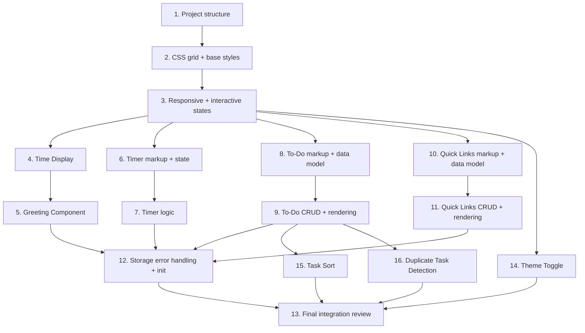

# Implementation Plan — To-Do List Life Dashboard

## Overview

This implementation plan provides a structured approach to building the To-Do List Life Dashboard, a single-page vanilla web app with five components: time display, greeting, focus timer, to-do list, and quick links. Three bonus enhancements — theme toggle, task sort, and duplicate task detection — are included as extra features. Tasks are ordered to build incrementally — project structure first, then layout and styling, then each component from simplest to most complex, followed by extra features, and ending with plumbing and edge-case hardening.

## Tasks

### Structure and Styling

- [x] 1. Create project directory structure and base HTML
  - Create `index.html` with the five card containers as semantic `<section>` elements
  - Create `css/` and `js/` directories
  - Link stylesheet and script in the HTML `<head>` and before `</body>` respectively
  - _Requirements: 7.1, 7.2_

- [x] 2. Implement CSS card grid layout and base styles
  - Write the `.dashboard` CSS Grid (`grid-template-columns: 2fr 1fr`, gap `1.5rem`)
  - Assign grid positions for `.time-greeting`, `.focus-timer`, `.todo-list`, `.quick-links`
  - Style card backgrounds (`#ffffff`), border-radius (`12px`), padding, box-shadow
  - Apply the full color palette (page background `#f0f2f5`, primary text `#1a1a2e`, accent `#3b82f6`, danger `#ef4444`, completed `#10b981`)
  - Set typography: font stack, clock `2.5rem` weight 700, greeting `1.25rem`, section headings uppercase muted, body `0.875rem`
  - _Requirements: 7.1, 7.2, 7.4_

- [x] 3. Implement responsive breakpoints and interactive states
  - Add `@media` queries for 480–768px (single column, reduced padding) and <480px (minimal padding, smaller fonts)
  - Style button transitions (`background-color 0.15s`, `transform 0.1s`), hover darkening, active scale
  - Style inputs with focus ring in accent color, `cursor: pointer` on interactive elements
  - Add `:focus-visible` outlines for keyboard accessibility
  - _Requirements: 7.3, 7.4, 7.6_

### Time and Greeting Components

- [x] 4. Implement Time Display component
  - Add clock and date elements inside `<div id="time-display">` in HTML
  - Write `updateClock()` in `js/app.js`: get current `Date()`, format `HH:MM:SS` with zero-padding, update `<span id="clock">`
  - Write date formatting: `Day, DD Month YYYY` into `<span id="date">`
  - Call `setInterval(updateClock, 1000)` on page load
  - _Requirements: 1.1, 1.2, 1.3, 1.4_

- [x] 5. Implement Greeting Component
  - Add `<div id="greeting">` inside the time‑greeting card in HTML
  - Write `updateGreeting()`: evaluate `currentHour` against thresholds (5–11 → "Good morning", 12–16 → "Good afternoon", 17–20 → "Good evening", 21–4 → "Good night")
  - Track previous greeting category to avoid unnecessary DOM writes
  - Wire `updateGreeting()` into the same 1-second interval tick
  - _Requirements: 2.1, 2.2, 2.3, 2.4, 2.5, 2.6_

### Focus Timer Component

- [x] 6. Implement Focus Timer component markup and state
  - Add timer display (`<span id="timer-display">25:00</span>`) and three buttons (Start, Stop, Reset) inside `<div id="focus-timer">`
  - Declare module-level state: `timerMinutes` (25), `timerSeconds` (0), `timerIntervalId` (null), `timerStatus` ("idle")
  - Disable the Stop button by default
  - _Requirements: 3.1, 3.2, 3.3, 3.4_

- [x] 7. Implement Focus Timer logic (start, stop, reset, completion)
  - Write `startTimer()`: guard against overlapping intervals, begin `setInterval(() => timerTick(), 1000)`, change status to "running", toggle button states
  - Write `stopTimer()`: clear interval, set status to "paused", change Start button text to "Resume"
  - Write `resetTimer()`: clear interval, reset to 25:00, return status to "idle", reset buttons
  - Write `timerTick()`: decrement seconds/minutes, clamp negatives to 00:00, update display
  - On completion (00:00): clear interval, notify user (visual flash + optional alert), auto-reset after 3 seconds
  - Attach click handlers to Start, Stop, Reset buttons
  - _Requirements: 3.5, 3.6, 3.7, 3.8_

### To-Do List Component

- [x] 8. Implement To-Do List markup and data model
  - Add input field (`<input id="todo-input">`), Add button (`<button id="todo-add">`), and `<ul id="todo-items">` inside `<div id="todo-list">`
  - Declare `tasks` array in module scope
  - Write `loadFromStorage()`: read `localStorage["tasks"]`, parse JSON, fall back to `[]` on corruption or missing data
  - Call `loadFromStorage()` during init to populate `tasks`
  - _Requirements: 4.1, 4.8, 4.9, 6.3_

- [x] 9. Implement To-Do List CRUD operations and rendering
  - Write `addTodo(text)`: create `{ id: crypto.randomUUID(), text, done: false }`, push to array, call `renderTodos()`, call `saveTodos()`
  - Write `toggleTodo(id)`: flip `done` boolean, re-render, save
  - Write `editTodo(id, newText)`: update text if non-empty, re-render, save; inline edit with Enter to confirm, Escape to cancel
  - Write `deleteTodo(id)`: filter out matching id, re-render, save
  - Write `renderTodos()`: clear `<ul>`, iterate tasks, build `<li>` with checkbox + text span + edit button + delete button; apply `text-decoration: line-through` with muted color when `done` is true
  - Write `saveTodos()`: `JSON.stringify(tasks)` into `localStorage["tasks"]`
  - Wire event listeners in `init()` for Add button click and Enter key on input
  - _Requirements: 4.2, 4.3, 4.4, 4.5, 4.6, 4.7, 6.1_

### Quick Links Component

- [x] 10. Implement Quick Links markup and data model
  - Add name input, URL input, Add button, and `<div id="links-grid">` inside `<div id="quick-links">`
  - Declare `links` array in module scope
  - Load `links` from `localStorage["links"]` during init (same pattern as tasks)
  - _Requirements: 5.1, 5.6, 5.7, 6.3_

- [x] 11. Implement Quick Links CRUD operations and rendering
  - Write `addLink(name, url)`: create `{ id: crypto.randomUUID(), name, url }`, push, re-render, save
  - Write `editLink(id, newName, newUrl)`: update matching link, re-render, save; inline form with Save/Cancel
  - Write `deleteLink(id)`: filter out matching id, re-render, save
  - Write `renderLinks()`: clear grid, iterate links, build styled `<button>` elements with edit and delete controls
  - Write `startEditLink(id)`: replace link card with inline edit form (name input + URL input + Save/Cancel buttons); Enter to save, Escape to cancel
  - Write `saveLinks()`: `JSON.stringify(links)` into `localStorage["links"]`
  - On link click: `window.open(link.url, '_blank', 'noopener,noreferrer')`
  - Wire event listeners in `init()`
  - _Requirements: 5.2, 5.3, 5.4, 5.5, 6.2_

### Extra Features

- [x] 14. Implement Theme Toggle
  - Add `<button id="theme-toggle" aria-label="Toggle theme" role="switch" aria-pressed="false">` to `index.html` outside the dashboard grid
  - Write `initTheme()`: read `localStorage["theme"]`; if absent, check `prefers-color-scheme: dark` media query; apply `.dark` class to `<html>` accordingly
  - Write `toggleTheme()`: toggle `.dark` class on `<html>`, save new value to `localStorage["theme"]`, call `updateThemeIcon()`
  - Write `updateThemeIcon()`: set button text to ☀ (dark mode) or 🌙 (light mode), update `aria-pressed` attribute
  - Wire click handler in `initEventListeners()`
  - Style `#theme-toggle`: fixed position top-right, circular, 40×40px, shadow, hover scale
  - _Extra Features: Theme Toggle_

- [x] 15. Implement Task Sort
  - Add `<select id="todo-sort">` with four `<option>` elements (pending, alpha, newest, oldest) inside a new `.todo-controls` wrapper in `index.html`
  - Declare `currentSort` variable initialized from `localStorage["todoSort"]` (default: `'pending'`)
  - Write `sortTasks(arr)`: return a shallow copy of the array sorted by the current sort criterion (pending: incomplete first; alpha: `localeCompare`; newest: reverse insertion order; oldest: no change)
  - Wire `change` handler on the `<select>`: update `currentSort`, save to `localStorage["todoSort"]`, call `renderTodos()`
  - Set `<select>` value to `currentSort` on init
  - Style `.todo-controls` as flex column, `#todo-sort` aligned to start
  - _Extra Features: Task Sort_

- [x] 16. Implement Duplicate Task Detection
  - In `addTodo(text)`: before pushing, check `tasks.some(t => t.text.toLowerCase() === trimmed.toLowerCase())`
  - If duplicate found, call `showTodoWarning('Task already exists')` and return without creating
  - Write `showTodoWarning(message)`: create or reuse `<div id="todo-warning">` after `.todo-input-row`, set text, clear previous timeout, set 2-second auto-dismiss timeout
  - Style `#todo-warning`: `color: var(--danger)`, `font-size: 0.8rem`, small top margin
  - _Extra Features: Duplicate Task Detection_

### Error Handling, Initialization, and Final Integration

- [x] 12. Implement storage error handling and init function
  - Write `storageAvailable()` utility to test if localStorage is accessible
  - Wrap all `localStorage` reads/writes in try-catch; on failure show a visible banner ("Storage unavailable — data will not be saved this session"), log a console warning, continue with in-memory data
  - Write `init()`: call `loadFromStorage()` for tasks and links, start `setInterval` for clock and greeting ticks, attach all event listeners
  - Wire `document.addEventListener('DOMContentLoaded', init)`
  - _Requirements: 6.4_

- [x] 13. Perform final integration review and verify completeness
  - Verify all five components render correctly on page load
  - Verify localStorage persistence across page reloads for tasks and links
  - Verify timer state machine (idle → running → paused → running → completed → idle) with no overlapping intervals
  - Verify responsive layout at all three breakpoints
  - Verify error handling when localStorage is unavailable (e.g., private browsing mode)
  - Confirm no external dependencies, frameworks, or libraries are used
  - _Requirements: All requirements_

## Task Dependency Graph



```json
{
  "waves": [
    { "wave": 1, "tasks": [1], "description": "Project scaffolding and HTML structure" },
    { "wave": 2, "tasks": [2], "description": "CSS Grid layout, card styles, typography, color palette" },
    { "wave": 3, "tasks": [3], "description": "Responsive breakpoints and interactive states" },
    { "wave": 4, "tasks": [4, 6, 8, 10], "description": "Component markup and data model (parallel)" },
    { "wave": 5, "tasks": [5, 7, 9, 11], "description": "Component logic and rendering (parallel)" },
    { "wave": 6, "tasks": [14, 15, 16], "description": "Extra features: theme toggle, task sort, duplicate detection (parallel)" },
    { "wave": 7, "tasks": [12], "description": "Init function wiring and storage error handling" },
    { "wave": 8, "tasks": [13], "description": "Final integration review and verification" }
  ]
}
```

## Notes

- Tasks 1–3 (structure and styling) are prerequisite for all component tasks — they establish the HTML scaffold, CSS grid, and visual foundation
- Components are built in order of complexity: passive display (clock/greeting) then interactive single-state (timer) then CRUD with persistence (to-do, links)
- Tasks 14–16 (extra features) depend on the base styling (task 3) and respective component logic (task 9 for sort/duplicate detection) but are independent of each other
- Task 12 wires all event listeners and initializes every component, so it must come after all component implementations
- Task 13 is a manual verification pass with no code changes — purely validation
